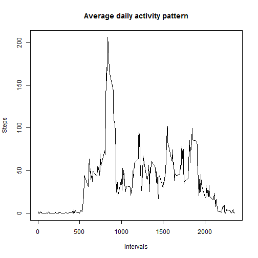

This report document has been made for the purposes of Assignment 1, part of the course "Reproducible Research" 

Part 1 => Loading and preprocessing the data
==================================

In order to load the data the following code is required:


```r
DF <- read.csv("activity.csv", header = TRUE)
```

The data are loaded in a data.frame called "DF".

Then the "date"" variable has been tranformed into "POSIXct" format using the Lubridate package, for a more convenient data manipulation:


```r
library(lubridate)

DF$date <- ymd(as.character(DF$date))
```

Then a couple of other libraries are loaded, which will be used in order to complete the assignment.


```r
library(plyr) ;library(data.table) ; library(dplyr) ; library(ggplot2) ; library(lattice)
```

```
## 
## Attaching package: 'plyr'
## 
## The following object is masked from 'package:lubridate':
## 
##     here
## 
## data.table 1.9.2  For help type: help("data.table")
## 
## Attaching package: 'data.table'
## 
## The following objects are masked from 'package:lubridate':
## 
##     hour, mday, month, quarter, wday, week, yday, year
## 
## 
## Attaching package: 'dplyr'
## 
## The following object is masked from 'package:data.table':
## 
##     last
## 
## The following objects are masked from 'package:plyr':
## 
##     arrange, desc, failwith, id, mutate, summarise, summarize
## 
## The following objects are masked from 'package:lubridate':
## 
##     intersect, setdiff, union
## 
## The following objects are masked from 'package:stats':
## 
##     filter, lag
## 
## The following objects are masked from 'package:base':
## 
##     intersect, setdiff, setequal, union
```

Also, we set the time zone and language ( otherwise it will all be "greek"" to you)

```r
Sys.setlocale("LC_TIME", "English")
```

```
## [1] "English_United States.1252"
```

Finally, the dataframe is converted to datatable so we can manipulate the data easier.

```r
DF1 <- data.table(DF) 
```

Part 2 => What is mean total number of steps taken per day?
===================================================

A.Make a histogram of the total number of steps taken each day.

To make the histogram we have to calculate the sum of steps for each day ( missing values are ignored.


```r
step_sums <- aggregate(steps ~ date, DF1, FUN =  sum, na.rm = TRUE)
```

Then we are ready to make the plot (using ggplot2, which we have already loaded):

```r
p <- qplot(date, data = step_sums,weight = steps, geom = "bar")

print(p)
```

```
## stat_bin: binwidth defaulted to range/30. Use 'binwidth = x' to adjust this.
```

 


Finally, we are calculating the mean and the median for the total number of steps taken per day:

```r
total_step_median <- median(step_sums$steps)
total_step_mean <- mean(step_sums$steps)

print(total_step_median)
```

```
## [1] 10765
```

```r
print(total_step_mean)
```

```
## [1] 10766.19
```


Part 3 => What is the average daily activity pattern?
=======================================================
In order to plot the "daily activity patern" we have to make a time series plot (i.e. type = "l") of the 5-minute interval (x-axis) and the average number of steps taken, averaged across all days (y-axis).

So we have to calculate the average steps taken for each interval acrross all 61 days.

We group our data by the interval:

```r
DF2 <- group_by(DF1, interval)

head(DF2)
```

```
##   steps       date interval
## 1    NA 2012-10-01        0
## 2     0 2012-10-02        0
## 3     0 2012-10-03        0
## 4    47 2012-10-04        0
## 5     0 2012-10-05        0
## 6     0 2012-10-06        0
```

Then, we calculate the mean for each interval, ignoring the missing values

```r
interval_avg <- aggregate(steps ~ interval, DF2, FUN = mean, na.rm = TRUE)
```

Now we are ready to make the plot:


```r
p1 <-plot(interval_avg$interval, interval_avg$steps, type = "l", main = "Average daily activity pattern", xlab = "Intervals", ylab = "Steps")
```

 

```r
print(p1)
```

```
## NULL
```

Then, we have to find which 5-min interval, on average across all the days in the dataset, contains the maximum number of steps.

The code is as follows:

```r
max = max(interval_avg$steps)
max_steps_intv <-  interval_avg["interval"][which(interval_avg["steps"] == max),]
print(max_steps_intv)
```

```
## [1] 835
```

The output (835) is the identifier for the 5-minute interval in which measurement was taken.

Part 4 => Imputing missing values

So far, as it has been stated, the missing values are ignored, but the presence of missing values may introduce bias into some calculations or summaries of the data.

First we have to calculate and report the total number of missing values in the dataset.


```r
missing_values <- sum(is.na(DF1))
print(missing_values)
```

```
## [1] 2304
```

```r
mean(is.na(DF1)) ## the NA's are 4,37% of the total observations
```

```
## [1] 0.04371585
```

So we have to come up with a strategy for filling the missing values. Amongst other, the choice is to fill NA's with the mean value of the 5-min interval which the NA 'belongs'.

We merge our dataset, and create a new column with the mean values of the intervals


```r
DF4 <- merge(DF2, interval_avg)

names(DF4) <- c("interval", "steps", "date", "mean_steps") ## setting the names again
```

```
## Warning in `names<-.data.table`(`*tmp*`, value = c("interval", "steps", :
## The names(x)<-value syntax copies the whole table. This is due to <- in R
## itself. Please change to setnames(x,old,new) which does not copy and is
## faster. See help('setnames'). You can safely ignore this warning if it is
## inconvenient to change right now. Setting options(warn=2) turns this
## warning into an error, so you can then use traceback() to find and change
## your names<- calls.
```

Then we assign to NA values the mean value of their interval, creating a new dataset without NA's:

```r
DF4$steps[is.na(DF4$steps)] <- DF4$mean_steps[is.na(DF4$steps)]
```

We have to calculate again the sum of steps for each day:


```r
step_sums <- aggregate(steps ~ date, DF4, FUN =  sum, na.rm = TRUE)
```

The new histogram of the total number of steps taken each day, indicates that there are no significant differences.


```r
p3 <- qplot(date, data = step_sums,weight = steps, geom = "bar")
print(p3)
```

```
## stat_bin: binwidth defaulted to range/30. Use 'binwidth = x' to adjust this.
```

 

Then the mean and median is calculated again:

```r
stepmedian <- median(step_sums$steps)
stepmean <- mean(step_sums$steps)
print(stepmedian)
```

```
## [1] 10766.19
```

```r
print(stepmean)
```

```
## [1] 10766.19
```

Part 4 => Are there differences in activity patterns between weekdays and weekends?
==================================================================================

Initially, we create a new column, named "day" with the day names ( i.e Monday, Tuesday..)


```r
DF4$day <- weekdays(DF4$date)
```

Then, the 'day' variable is turned into a factor variable with two levels ( "weekday", "weekend").

```r
DF4$day <- factor(ifelse(DF4$day %in% c('Saturday','Sunday'), 'weekend','weekday'))
```

Now, using the lattice plotting system , we can create a panel plot to demonstrate the activity patterns separately for weekdays and weekends:


```r
plot_weekend <- xyplot( mean_steps ~ interval | day, data = DF4, type = "l",ylab = "Steps",main = "Activity Patterns" , layout = c(1,2))

print(plot_weekend)
```

 


